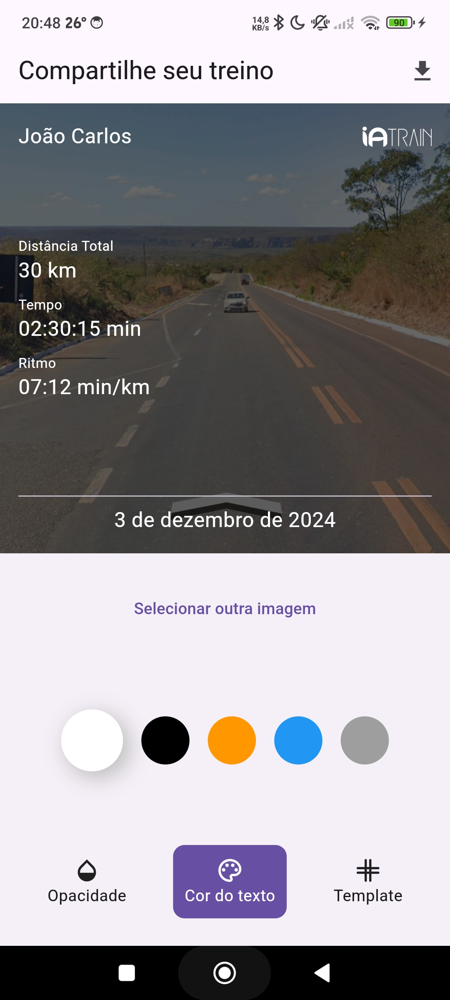
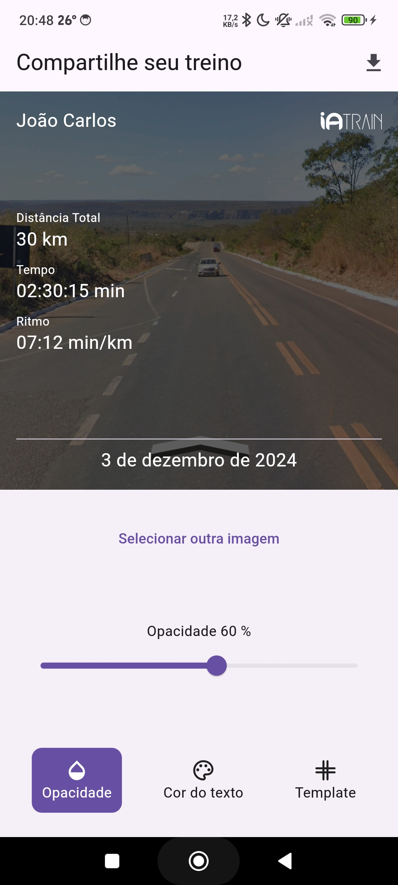
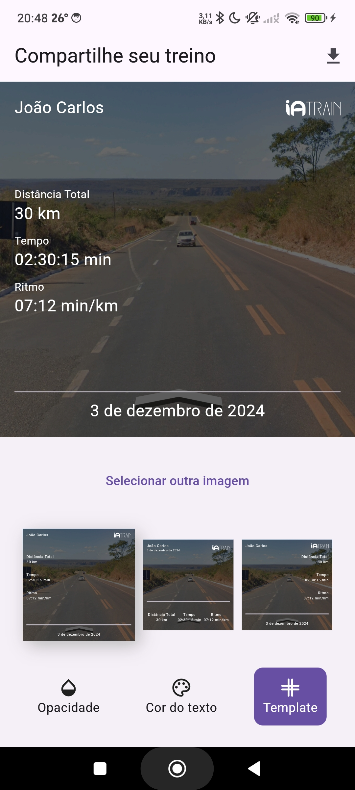

# Exportação de Imagens

Este projeto permite capturar uma área específica da tela usando o `RepaintBoundary`,  salvar a captura como imagem e compartilhar o arquivo com outros aplicativos. 

## Recursos
- Captura de área da tela com `RepaintBoundary`.
- Exportação de imagem com data e hora no nome.
- Compartilhamento da imagem com o pacote `share_plus`.

---

## Captura de Tela

  
  
  

*Capturas de tela - cor do texto, opacidade da imagem, templates disponiveis respectivamente*

---

